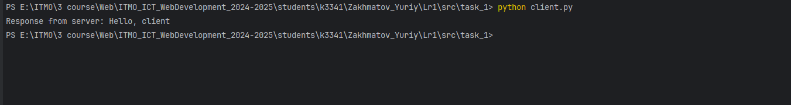

## Задание 1:

---
<b>Содержание:</b> Реализовать клиентскую и серверную часть приложения. Клиент отправляет серверу сообщение «Hello, server», и оно должно отобразиться на стороне сервера. В ответ сервер отправляет клиенту сообщение «Hello, client», которое должно отобразиться у клиента.

<b>Требования:</b> Обязательно использовать библиотеку socket.
Реализовать с помощью протокола UDP.

---
<b>Выполнение: </b>

1. Создаем скрипт для сервера: 
~~~python
import socket

def run():
    # Создание UDP сокета
    server_socket = socket.socket(socket.AF_INET, socket.SOCK_DGRAM)

    # Задаем параметры
    server_address = ("localhost", 8080)
    server_socket.bind(server_address)

    print(f"Server started on {server_address[0]}:{server_address[1]}")
    print("Awaiting connection...")

    try:
        while True:
            # Получаем запрос клиента

            data, client_address = server_socket.recvfrom(1024)
            message = data.decode("utf-8")

            print(f"Received message from {client_address} : {message}")

            # отправляем ответ клиенту
            response = "Hello, client"
            server_socket.sendto(response.encode("utf-8"), client_address)
            print(f"Sent response to {client_address}")
    except Exception:
        print("\nServer shutting down...")
    finally:
        server_socket.close()

if __name__ == "__main__":
    run()
~~~
---
2. Создаем скрипт для клиента
~~~python
import socket

def run():
    #Создаем сокет для клиента UDP
    client_socket = socket.socket(socket.AF_INET, socket.SOCK_DGRAM)

    try:
        #Подключаемся к сокету
        client_socket.connect(('localhost', 8080))

        #Отправляем сообщение
        client_socket.sendall(b'Hello, server')

        #Получаем ответ
        response = client_socket.recv(1024)
        print(f"Response from server: {response.decode('utf-8')}")
    except Exception as e:
        print(e)
    finally:
        client_socket.close()

if __name__ == '__main__':
    run()
~~~
---
3. Запускаем сервер

---
4. Запускаем скрипт

---
5. Скрин с сервера
